# Chapter 3 — Storage and Retrieval

### Chapter preview

Two halves: how a database **stores and finds** data (storage engines and indexes, for transactions), and how **analytics** changes the design (warehouses and column storage).

#### 1. Logs and practical implementation

An append-only **log** is the simplest database: `db_set` appends a line, `db_get` scans the whole file, so reads are O(n). A **hash index** (key → byte offset) speeds up reads. Practical details: split the log into **segments**, **compact** old ones, and **merge** them in the background. This is Bitcask's design.

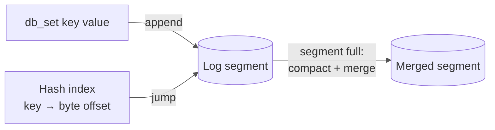
```mermaid
%%{init: {'themeVariables': {'fontSize': '18px', 'primaryColor': '#f5f0e6', 'primaryBorderColor': '#555', 'primaryTextColor': '#222', 'lineColor': '#555'}}}%%
flowchart LR
    W["db_set key value"] -->|"append"| LOG[("Log segment")]
    HASH["Hash index<br/>key → byte offset"] -->|"jump"| LOG
    LOG -->|"segment full:<br/>compact + merge"| NEW[("Merged segment")]
```

#### 2. SSTables

**SSTable** = Sorted String Table: a log segment whose keys are **sorted**. Benefits: merging segments is a fast sequential merge-sort, and the index can be **sparse** (one key per few KB), because a key is found by scanning a small sorted range.

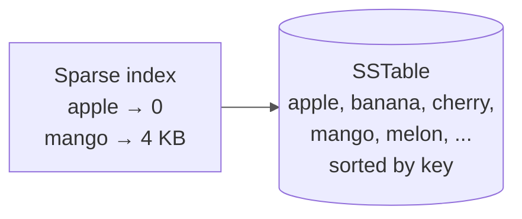
```mermaid
%%{init: {'themeVariables': {'fontSize': '18px', 'primaryColor': '#f5f0e6', 'primaryBorderColor': '#555', 'primaryTextColor': '#222', 'lineColor': '#555'}}}%%
flowchart LR
    SP["Sparse index<br/>apple → 0<br/>mango → 4 KB"] --> SS[("SSTable<br/>apple, banana, cherry,<br/>mango, melon, ...<br/>sorted by key")]
```

#### 3. LSM-trees

**LSM-tree** = Log-Structured Merge-tree: writes go to an in-memory sorted **memtable**, which is flushed to an immutable SSTable when full. Background **compaction** merges SSTables. Reads check the memtable, then SSTables newest first (a **Bloom filter** skips SSTables that cannot hold the key). Very fast writes, used by Cassandra, RocksDB and Elasticsearch (Lucene).

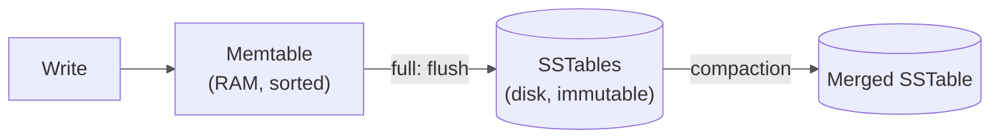
```mermaid
%%{init: {'themeVariables': {'fontSize': '18px', 'primaryColor': '#f5f0e6', 'primaryBorderColor': '#555', 'primaryTextColor': '#222', 'lineColor': '#555'}}}%%
flowchart LR
    W["Write"] --> MT["Memtable<br/>(RAM, sorted)"] -->|"full: flush"| SS[("SSTables<br/>(disk, immutable)")] -->|"compaction"| M[("Merged SSTable")]
```

#### 4. B-trees

The most common index in relational databases. Data is kept in fixed-size **pages** (about 4 KB) organized as a tree, with a high **branching factor**, so a lookup touches only a few levels. Writes **update pages in place**, protected by a **WAL** (write-ahead log) for crash recovery. Used by SQLite, PostgreSQL and MySQL (InnoDB).

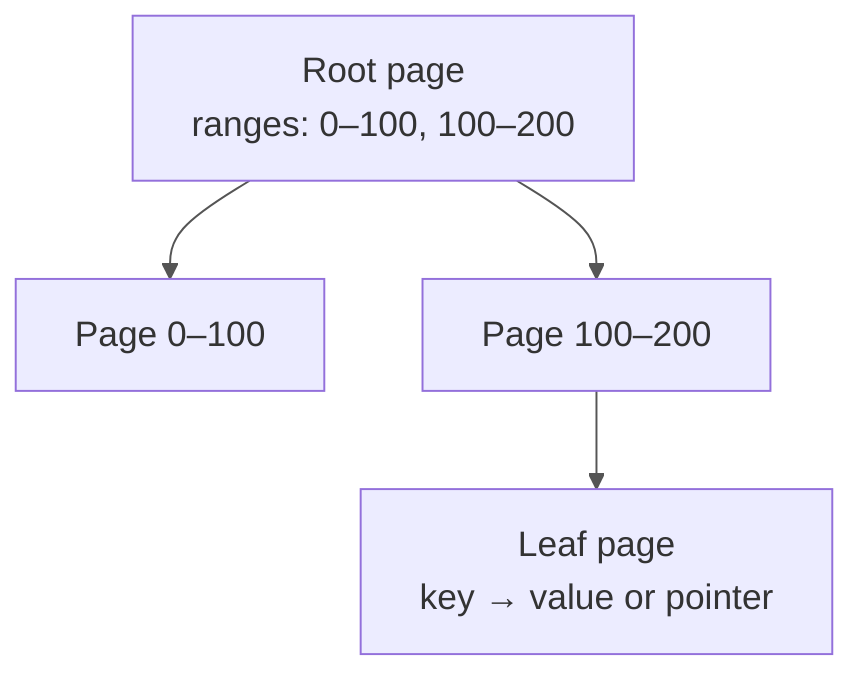
```mermaid
%%{init: {'themeVariables': {'fontSize': '18px', 'primaryColor': '#f5f0e6', 'primaryBorderColor': '#555', 'primaryTextColor': '#222', 'lineColor': '#555'}}}%%
flowchart TB
    ROOT["Root page<br/>ranges: 0–100, 100–200"] --> P1["Page 0–100"]
    ROOT --> P2["Page 100–200"]
    P2 --> LEAF["Leaf page<br/>key → value or pointer"]
```

#### 5. Workload and data warehouse

Workloads differ. **OLTP** (online transaction processing) serves many small key-based reads and writes, with **ACID** guarantees (Atomicity, Consistency, Isolation, Durability). **OLAP** (online analytical processing) scans huge numbers of rows and computes aggregates. A **data warehouse** is a separate read-only copy of the OLTP data, loaded by **ETL** (Extract–Transform–Load) and modeled as a **star schema**: a central fact table plus dimension tables.

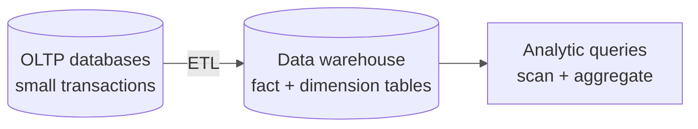
```mermaid
%%{init: {'themeVariables': {'fontSize': '18px', 'primaryColor': '#f5f0e6', 'primaryBorderColor': '#555', 'primaryTextColor': '#222', 'lineColor': '#555'}}}%%
flowchart LR
    OLTP[("OLTP databases<br/>small transactions")] -->|"ETL"| DW[("Data warehouse<br/>fact + dimension tables")] --> Q["Analytic queries<br/>scan + aggregate"]
```

#### 6. Store and scan by column

Analytic queries read a few columns of millions of rows, so a **column store** keeps each column in its own file and reads only the columns it needs. Columns compress well (bitmaps, **run-length encoding**), and **vectorized processing** (SIMD, single instruction multiple data) runs tight loops on compressed chunks in the CPU cache. Rows are sorted by chosen keys, which helps range queries and compression.

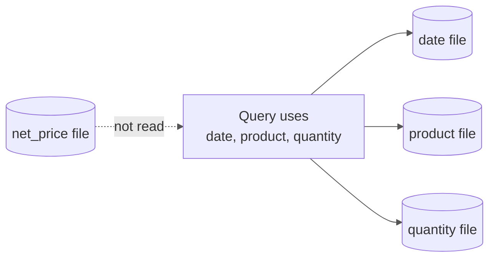
```mermaid
%%{init: {'themeVariables': {'fontSize': '18px', 'primaryColor': '#f5f0e6', 'primaryBorderColor': '#555', 'primaryTextColor': '#222', 'lineColor': '#555'}}}%%
flowchart LR
    Q["Query uses<br/>date, product, quantity"] --> C1[("date file")]
    Q --> C2[("product file")]
    Q --> C3[("quantity file")]
    C4[("net_price file")] -.->|"not read"| Q
```

#### 7. Indexes + Cassandra

A **primary index** finds a row by key. **Secondary indexes** find rows by other columns, and can point into a **heap file**, be **clustered** (the row is stored in the index) or **covering** (include some columns). **Cassandra** shows how they combine: an LSM-tree engine, with a **partition key** that chooses the node and **clustering columns** that sort rows inside a partition (a concatenated index).

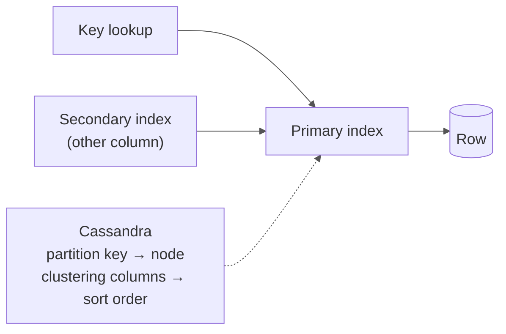
```mermaid
%%{init: {'themeVariables': {'fontSize': '18px', 'primaryColor': '#f5f0e6', 'primaryBorderColor': '#555', 'primaryTextColor': '#222', 'lineColor': '#555'}}}%%
flowchart LR
    K["Key lookup"] --> PK["Primary index"] --> ROW[("Row")]
    S["Secondary index<br/>(other column)"] --> PK
    C["Cassandra<br/>partition key → node<br/>clustering columns → sort order"] -.-> PK
```

#### Also covered

- **In-memory databases** — keep all data in RAM (Redis, VoltDB); durability via logs, snapshots or replicas.
- **Other indexes** — multi-column (concatenated), R-tree for geospatial data, full-text and fuzzy search (Lucene).

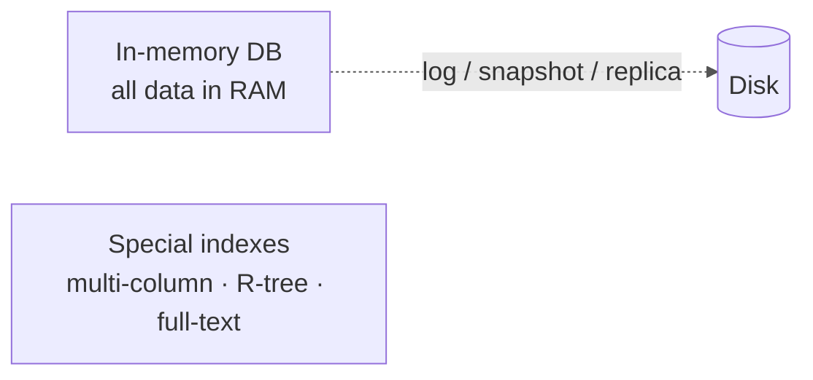
```mermaid
%%{init: {'themeVariables': {'fontSize': '18px', 'primaryColor': '#f5f0e6', 'primaryBorderColor': '#555', 'primaryTextColor': '#222', 'lineColor': '#555'}}}%%
flowchart LR
    RAM["In-memory DB<br/>all data in RAM"] -.->|"log / snapshot / replica"| DISK[("Disk")]
    IDX["Special indexes<br/>multi-column · R-tree · full-text"]
```

---

### Why storage engines matter

You do need to select a storage engine that's appropriate for your application, from the many available — this holds for traditional relational databases and for most so-called NoSQL databases too.

### The naive approach: append + scan

A JSON-based key-value store can be built in a few lines: `db_set key value` appends a line to a file, and `db_get key` scans the entire file from beginning to end looking for occurrences of that key, returning the most recent value found. And it works:

```
$ db_set 123456 '{"name":"London","attractions":["Big Ben","London Eye"]}'
$ db_get 123456
{"name":"London","attractions":["Big Ben","London Eye"]}
```

The problem is cost: in algorithmic terms, every lookup is **O(n)** — if you have a million records, `db_get` may have to read all of them just to find one.

### Indexes: trading write cost for read speed

To improve on O(n), we need a different data structure: an **index**. An index is extra, *derived* structure built from the primary data — it doesn't change the data itself, which is why most databases let you add or remove indexes freely without touching the underlying records.

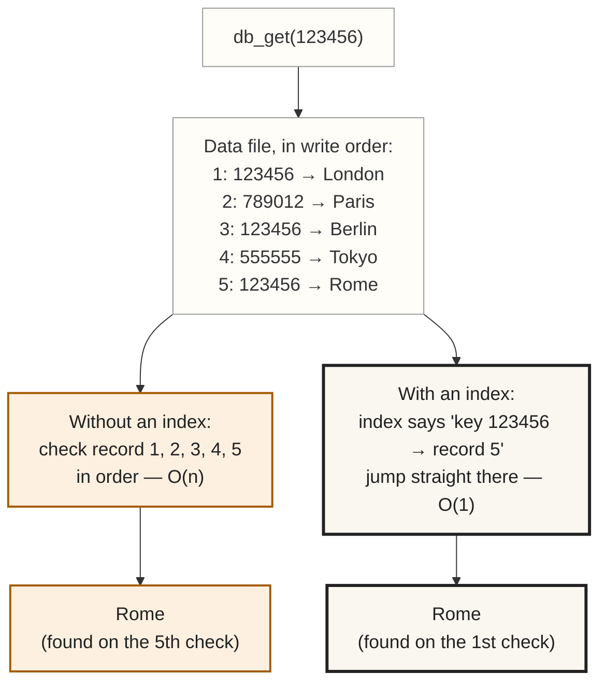
```mermaid
%%{init: {'themeVariables': {'fontSize': '18px'}}}%%
flowchart TB
    FILE["Data file, in write order:<br/>1: 123456 → London<br/>2: 789012 → Paris<br/>3: 123456 → Berlin<br/>4: 555555 → Tokyo<br/>5: 123456 → Rome"]

    Q["db_get(123456)"] --> FILE

    FILE --> SCAN["Without an index:<br/>check record 1, 2, 3, 4, 5<br/>in order — O(n)"]
    FILE --> LOOKUP["With an index:<br/>index says 'key 123456 → record 5'<br/>jump straight there — O(1)"]

    SCAN --> RES1["Rome<br/>(found on the 5th check)"]
    LOOKUP --> RES2["Rome<br/>(found on the 1st check)"]

    classDef slow fill:#fdf0e0,stroke:#a35b00,stroke-width:2px,color:#222,font-size:18px;
    classDef fast fill:#faf7f0,stroke:#222,stroke-width:3px,color:#222,font-size:18px;
    classDef file fill:#fffdf8,stroke:#999,stroke-width:1px,color:#333,font-size:18px;

    class FILE,Q file;
    class SCAN,RES1 slow;
    class LOOKUP,RES2 fast;
```

Key `123456` was written three times — the file just keeps appending, so the value keeps changing (`London` → `Berlin` → `Rome`). Without an index, `db_get` has to check every record to be sure it has the *last* one. With an index pointing straight at record 5, it skips the other four entirely.

**The trade-off**: a well-chosen index speeds up the read queries that use it, but every index has to be updated on every write — so more indexes means slower writes. Choosing which columns to index is a deliberate read/write trade-off, not a free win.

### Hash indexes

The simplest possible indexing strategy, and the building block for more complex indexes: keep an **in-memory hash map** where every key maps to the byte offset of its value in the data file.

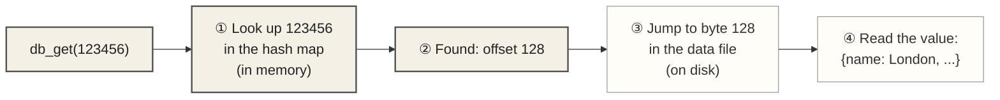
```mermaid
%%{init: {'themeVariables': {'fontSize': '18px'}}}%%
flowchart LR
    K["db_get(123456)"] --> HM["① Look up 123456<br/>in the hash map<br/>(in memory)"]
    HM --> OFF["② Found: offset 128"]
    OFF --> DISK["③ Jump to byte 128<br/>in the data file<br/>(on disk)"]
    DISK --> VAL["④ Read the value:<br/>{name: London, ...}"]

    classDef mem fill:#f5f0e6,stroke:#555,stroke-width:2px,color:#222,font-size:18px;
    classDef disk fill:#fffdf8,stroke:#999,stroke-width:1px,color:#333,font-size:18px;

    class K,HM,OFF mem;
    class DISK,VAL disk;
```

Only step ③ touches disk, and it's a single direct seek — no scanning. This is exactly the strategy a storage engine like Bitcask builds on: an in-memory hash map (fast) that tells you exactly where to look on disk (one read).

### Storage engine like Bitcask
A storage engine like Bitcask is well suited to situations where the value for each key
is updated frequently. For example, the key might be the URL (Uniform Resource Locator) of a cat video, and the
value might be the number of times it has been played


Segments are never modified after they've been written — they're immutable, append-only files. That one property drives everything below: how compaction runs safely in the background, and how a read finds a key across several segments at once.

#### Case 1 — background merge and compaction

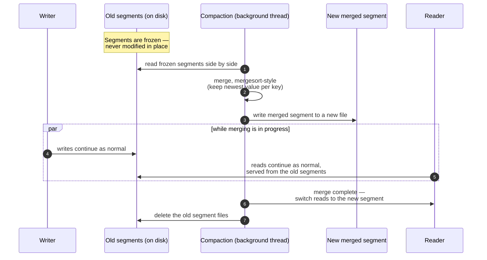
```mermaid
%%{init: {'themeVariables': {'fontSize': '18px'}}}%%
sequenceDiagram
    autonumber
    participant W as Writer
    participant OLD as Old segments (on disk)
    participant BG as Compaction (background thread)
    participant NEW as New merged segment
    participant R as Reader

    Note over OLD: Segments are frozen —<br/>never modified in place
    BG->>OLD: read frozen segments side by side
    BG->>BG: merge, mergesort-style<br/>(keep newest value per key)
    BG->>NEW: write merged segment to a new file

    par while merging is in progress
        W->>OLD: writes continue as normal
        R->>OLD: reads continue as normal,<br/>served from the old segments
    end

    BG->>R: merge complete —<br/>switch reads to the new segment
    BG->>OLD: delete the old segment files
```

| Step | Actor | What happens | Why it matters |
|---|---|---|---|
| 1–2 | Compaction | Reads the frozen segments side by side, merging them mergesort-style | Segments are already sorted, so merging is a single linear pass, not a re-sort |
| 3 | Compaction | Writes the result to a brand-new merged segment file | Old segments are never edited in place — a new file is always written instead |
| 4 | Writer / Reader | Normal reads and writes keep being served from the old segments the whole time | Compaction runs in the background without blocking or pausing traffic |
| 5 | Compaction | Once the merge is complete, read requests are switched over to the new segment | The cutover is atomic from the reader's point of view — no half-merged state is ever visible |
| 6 | Compaction | The old segment files are deleted | They're now redundant — the new segment has everything they had, deduplicated |

#### Case 2 — looking up a key across segments

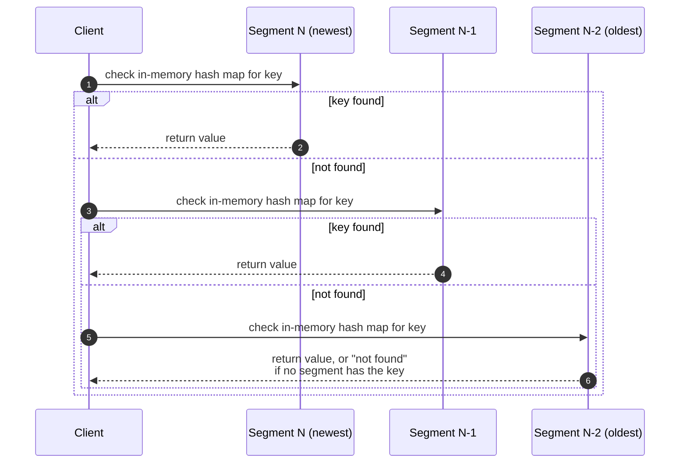
```mermaid
%%{init: {'themeVariables': {'fontSize': '18px'}}}%%
sequenceDiagram
    autonumber
    participant C as Client
    participant S3 as Segment N (newest)
    participant S2 as Segment N-1
    participant S1 as Segment N-2 (oldest)

    C->>S3: check in-memory hash map for key
    alt key found
        S3-->>C: return value
    else not found
        C->>S2: check in-memory hash map for key
        alt key found
            S2-->>C: return value
        else not found
            C->>S1: check in-memory hash map for key
            S1-->>C: return value, or "not found"<br/>if no segment has the key
        end
    end
```

Each segment keeps its own in-memory hash table (key → file offset). A lookup checks the newest segment's hash map first, then the next-most-recent, and so on — because compaction keeps merging segments down to a small number, a read rarely has to check more than a couple of hash maps before it finds the key (or exhausts them all).

Lots of detail goes into making this simple idea work in practice. Briefly, some of the issues that are important in a real implementation are:


### Practical implementation details

- **File format** — a binary format beats CSV for a log: encode a string's length first, then its raw bytes, so there's no escaping to worry about.
  *Example: instead of `123,hello world` (which breaks the moment a value contains a comma), store `<len=11><hello world>` — the reader just reads the length, then reads exactly that many bytes.*
- **Deleting records** — a delete doesn't remove anything; it appends a special **tombstone** record. The next merge sees the tombstone and drops every older value for that key.
  *Example: `db_delete(123456)` appends a tombstone for `123456`; when segments are next compacted, all earlier `123456 → ...` entries are discarded from the merged file.*
- **Crash recovery** — in-memory hash maps are lost on restart. Rebuilding one by scanning its whole segment file works but is slow for large segments, so Bitcask instead snapshots each segment's hash map to disk and reloads that snapshot on startup.
  *Example: instead of re-scanning a 2 GB segment key-by-key, Bitcask loads a small pre-saved `segment.hashindex` file straight into memory.*
- **Partially written records** — a crash can happen mid-append, leaving a corrupted record at the end of the log. Checksums let the engine detect and skip that corrupted tail instead of returning garbage.
  *Example: each record is stored as `<length><checksum><data>`; on recovery, if the computed checksum doesn't match, that record (and anything after it) is discarded.*
- **Concurrency control** — writes are appended in strict sequential order, so a common design is a single writer thread; since segments are append-only and otherwise immutable, any number of readers can read concurrently with no locking needed.
  *Example: one thread owns every `db_set` call and appends them one at a time, while many request-handling threads call `db_get` on the same old segments simultaneously, with no coordination required.*


### Limitations of the hash table index

- **Must fit in memory** — every key needs a slot in the in-memory hash map. With a huge number of keys, you run out of RAM. An on-disk hash map sounds like a fix, but it performs poorly in practice: it needs lots of random-access I/O, is expensive to grow once full, and hash collisions require fiddly extra logic.
  *Example: a billion unique keys means a billion hash-map entries to keep resident in memory, regardless of how small each value on disk is.*
- **No efficient range queries** — a hash map only answers "does this exact key exist," so there's no way to scan a contiguous range of keys without looking each one up individually.
  *Example: finding every key between `kitty00000` and `kitty99999` means issuing 100,000 separate point lookups — there's no way to just "scan from here to there."*


### SSTables (Sorted String Tables) and LSM-Trees (Log-Structured Merge-Trees)

Segments get their keys sorted before being written to disk — a **Sorted String Table (SSTable)**. Sorting unlocks three things:

- **Merge (compaction)** — read several sorted segment files side by side, like a mergesort: always emit the lowest key next, producing one new sorted, merged segment. If a key exists in more than one segment, only the value from the *newest* segment survives; older duplicates are discarded.
- **Sparse index** — because segments are sorted, you don't need every key in memory. A sparse in-memory index (e.g., one entry per few KB, where KB = kilobyte) gives you the nearest known offset below the target key; from there you scan forward until you find it (or don't).
- **Block compression** — the records between two sparse-index entries are grouped into a block and compressed before being written to disk. Each sparse-index entry then points at the start of its compressed block, saving disk space and reducing I/O.

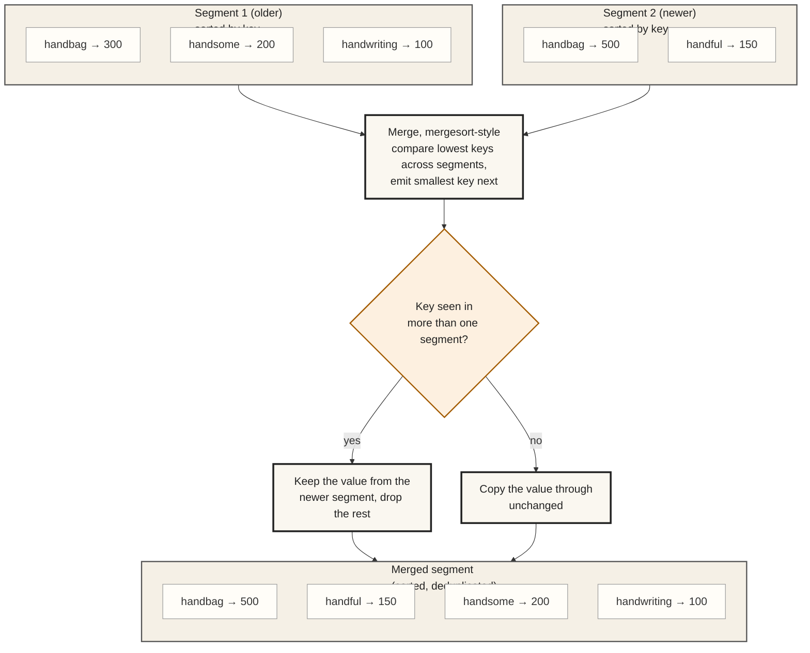
```mermaid
%%{init: {'themeVariables': {'fontSize': '18px'}}}%%
flowchart TB
    subgraph SEG1["Segment 1 (older)<br/>sorted by key"]
        direction TB
        A1["handbag → 300"]
        A2["handsome → 200"]
        A3["handwriting → 100"]
    end

    subgraph SEG2["Segment 2 (newer)<br/>sorted by key"]
        direction TB
        B1["handbag → 500"]
        B2["handful → 150"]
    end

    SEG1 --> M["Merge, mergesort-style<br/>compare lowest keys across segments,<br/>emit smallest key next"]
    SEG2 --> M

    M --> D{"Key seen in<br/>more than one segment?"}
    D -->|"yes"| K["Keep the value from the<br/>newer segment, drop the rest"]
    D -->|"no"| P["Copy the value through<br/>unchanged"]

    K --> OUT
    P --> OUT

    subgraph OUT["Merged segment<br/>(sorted, deduplicated)"]
        direction TB
        O1["handbag → 500"]
        O2["handful → 150"]
        O3["handsome → 200"]
        O4["handwriting → 100"]
    end

    classDef seg fill:#f5f0e6,stroke:#555,stroke-width:2px,color:#222,font-size:18px;
    classDef item fill:#fffdf8,stroke:#999,stroke-width:1px,color:#333,font-size:18px;
    classDef proc fill:#faf7f0,stroke:#222,stroke-width:3px,color:#222,font-size:18px;
    classDef decision fill:#fdf0e0,stroke:#a35b00,stroke-width:2px,color:#222,font-size:18px;

    class SEG1,SEG2,OUT seg;
    class A1,A2,A3,B1,B2,O1,O2,O3,O4 item;
    class M,K,P proc;
    class D decision;
```

**Lookup sequence** — finding a key using the sparse index and a compressed block:

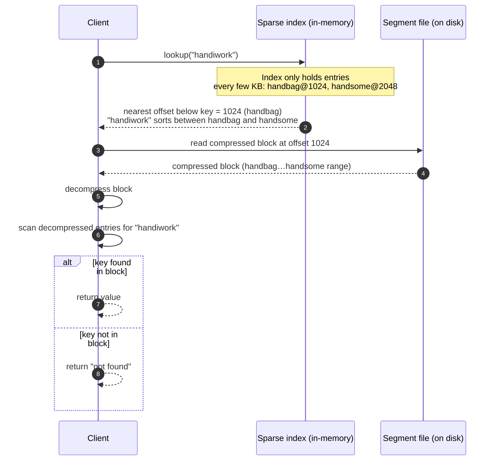
```mermaid
%%{init: {'themeVariables': {'fontSize': '18px'}}}%%
sequenceDiagram
    autonumber
    participant C as Client
    participant SI as Sparse index (in-memory)
    participant SF as Segment file (on disk)

    C->>SI: lookup("handiwork")
    Note over SI: Index only holds entries<br/>every few KB: handbag@1024, handsome@2048
    SI-->>C: nearest offset below key = 1024 (handbag)<br/>"handiwork" sorts between handbag and handsome
    C->>SF: read compressed block at offset 1024
    SF-->>C: compressed block (handbag…handsome range)
    C->>C: decompress block
    C->>C: scan decompressed entries for "handiwork"
    alt key found in block
        C-->>C: return value
    else key not in block
        C-->>C: return "not found"
    end
```


### Making an LSM-tree out of SSTables

This memtable-then-SSTable pattern — buffer writes in memory, flush them as an immutable sorted file, merge those files in the background — is the **LSM-tree** (Log-Structured Merge-tree). It's the same idea whether the "value" is a database row or a search-index postings list: **LevelDB**, **RocksDB**, **Cassandra**, and **HBase** all use it for key-value storage (tracing back to Google's Bigtable paper, which coined *SSTable* and *memtable*); **Lucene** (the engine behind **Elasticsearch** and **Solr**) uses the identical structure to store its term dictionary — key = word, value = the postings list of document IDs that contain it.

#### Real-world example — Cassandra (STAR: Situation, Task, Action, Result)

- **Situation** — Discord needed to store and serve tens of billions of chat messages, with an extremely write-heavy workload (far more writes than reads) spread across globally distributed servers.
- **Task** — pick a storage engine that sustains very high, steady write throughput without lock contention, while still supporting fast reads of a channel's most recent messages.
- **Action** — Discord ran Cassandra, whose storage engine is an LSM-tree: every write lands in an in-memory memtable (plus a commit log for durability) with no in-place updates, so writes are always sequential appends. The memtable periodically flushes to an immutable, sorted SSTable on disk, and a background compaction process merges SSTables belonging to the same partition, dropping overwritten/deleted messages and keeping the number of files a read has to check bounded.
- **Result** — Discord sustained huge write volumes without write-side locking; when a handful of extremely active channels grew into oversized partitions, compaction (merging ever-larger SSTables) became the bottleneck — a direct, real-world hit of the exact merge process from the diagram above — which drove Discord's later partitioning redesign and eventual move to ScyllaDB, a Cassandra-compatible engine built on the same SSTable/LSM design.

> [!WARNING]
> **L-A-M-P — why the Result played out this way:**
>
> - **L — Load**: Discord's write volume wasn't a spike, it was sustained and massive — tens of billions of messages, arriving continuously across many channels at once.
> - **A — Append, not update**: every write is an *append* to the commit log and the in-memory memtable, so there's nothing to lock — two writers never fight over the same on-disk bytes. That's why huge load didn't translate into write-side lock contention.
> - **M — Merge (compaction)**: appends alone would leave thousands of small SSTables piling up forever, so a background process periodically *merges* the SSTables belonging to one partition into a single, deduplicated, sorted file — the same merge shown in the diagram above.
> - **P — Partition size**: the merge cost scales with how much data is in the partition being merged. A normal channel's partition stays small, so compaction is cheap. But a handful of extremely active channels kept accumulating messages into one *ever-growing partition* — so their SSTables kept getting bigger, and merging them got slower and more I/O-heavy each time, until compaction itself became the bottleneck.
>
> In short: **append-only writes removed the lock problem, but merge cost is proportional to partition size** — so the same LSM-tree design that made writes cheap made compaction expensive for the few partitions that grew too large.

> [!IMPORTANT]
> **Cassandra never modifies a record in place.** The old bytes for a key are never touched or overwritten — a new write is always a fresh append, and the superseded value just sits there until a later compaction drops it. This one design choice is the mechanical reason massive write load never turned into write-side lock contention.

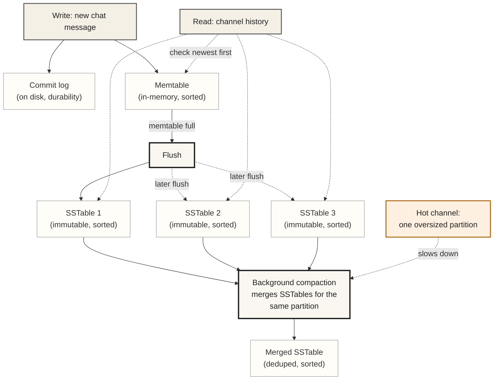
```mermaid
%%{init: {'themeVariables': {'fontSize': '18px'}}}%%
flowchart TB
    W["Write: new chat message"] --> CL["Commit log<br/>(on disk, durability)"]
    W --> MT["Memtable<br/>(in-memory, sorted)"]

    MT -->|"memtable full"| FLUSH["Flush"]
    FLUSH --> SS1["SSTable 1<br/>(immutable, sorted)"]
    FLUSH -.->|"later flush"| SS2["SSTable 2<br/>(immutable, sorted)"]
    FLUSH -.->|"later flush"| SS3["SSTable 3<br/>(immutable, sorted)"]

    SS1 --> COMP["Background compaction<br/>merges SSTables for the<br/>same partition"]
    SS2 --> COMP
    SS3 --> COMP
    COMP --> MERGED["Merged SSTable<br/>(deduped, sorted)"]

    R["Read: channel history"] -.->|"check newest first"| MT
    R -.-> SS1
    R -.-> SS2
    R -.-> SS3

    HOT["Hot channel:<br/>one oversized partition"] -.->|"slows down"| COMP

    classDef write fill:#f5f0e6,stroke:#555,stroke-width:2px,color:#222,font-size:18px;
    classDef store fill:#fffdf8,stroke:#999,stroke-width:1px,color:#333,font-size:18px;
    classDef proc fill:#faf7f0,stroke:#222,stroke-width:3px,color:#222,font-size:18px;
    classDef warn fill:#fdf0e0,stroke:#a35b00,stroke-width:2px,color:#222,font-size:18px;

    class W,R write;
    class CL,MT,SS1,SS2,SS3,MERGED store;
    class FLUSH,COMP proc;
    class HOT warn;
```

#### Real-world example — Elasticsearch (STAR)

- **Situation** — Wikipedia (via its **CirrusSearch** backend) needed full-text search across tens of millions of constantly edited articles, where a query for a word must return every matching article, ranked, in well under a second.
- **Task** — maintain a term → postings-list index (word → article IDs) that stays queryable while absorbing constant edits, without rebuilding the whole index on every change.
- **Action** — CirrusSearch runs on Elasticsearch, built on Lucene. Each batch of new/edited documents is buffered in memory and flushed as a new, small, immutable segment — Lucene's SSTable — holding a sorted term dictionary and its postings lists. A background merge process continuously combines small segments into larger ones, exactly like SSTable compaction: it physically removes postings for deleted/updated documents and keeps the number of segments a query has to scan bounded.
- **Result** — edits become searchable within seconds (near-real-time search) because writes only ever create new sorted segments — never an in-place rewrite of a giant index — while background merging keeps query latency low as the corpus keeps growing.

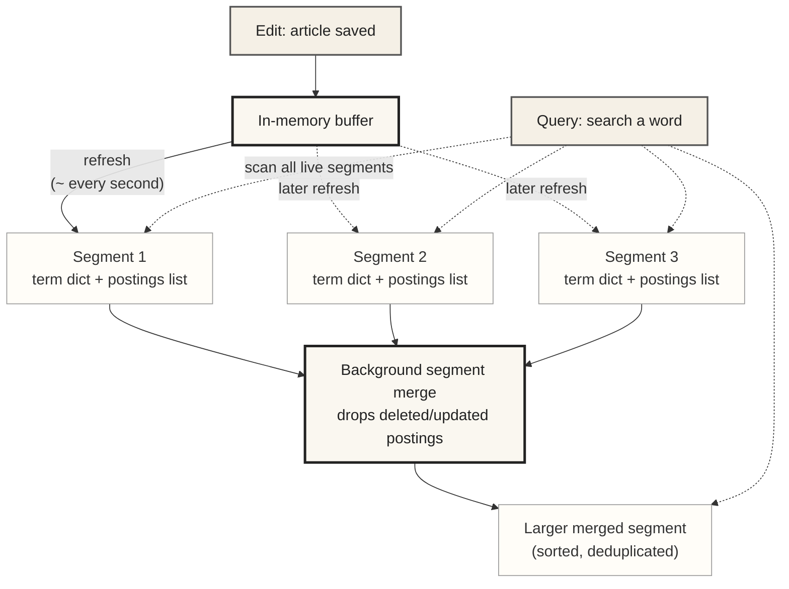
```mermaid
%%{init: {'themeVariables': {'fontSize': '18px'}}}%%
flowchart TB
    E["Edit: article saved"] --> BUF["In-memory buffer"]
    BUF -->|"refresh<br/>(~ every second)"| SEG1["Segment 1<br/>term dict + postings list"]
    BUF -.->|"later refresh"| SEG2["Segment 2<br/>term dict + postings list"]
    BUF -.->|"later refresh"| SEG3["Segment 3<br/>term dict + postings list"]

    SEG1 --> MERGE["Background segment merge<br/>drops deleted/updated postings"]
    SEG2 --> MERGE
    SEG3 --> MERGE
    MERGE --> BIG["Larger merged segment<br/>(sorted, deduplicated)"]

    Q["Query: search a word"] -.->|"scan all live segments"| SEG1
    Q -.-> SEG2
    Q -.-> SEG3
    Q -.-> BIG

    classDef write fill:#f5f0e6,stroke:#555,stroke-width:2px,color:#222,font-size:18px;
    classDef store fill:#fffdf8,stroke:#999,stroke-width:1px,color:#333,font-size:18px;
    classDef proc fill:#faf7f0,stroke:#222,stroke-width:3px,color:#222,font-size:18px;

    class E,Q write;
    class SEG1,SEG2,SEG3,BIG store;
    class BUF,MERGE proc;
```


### Performance optimizations
A Bloom filter is a memory-efficient
data structure for approximating the contents of a set. It can tell you if a key does not
appear in the database, and thus saves many unnecessary disk reads for nonexistent
keys.

The most common options are size-tiered and leveled
compaction. LevelDB and RocksDB use leveled compaction (hence the name of Lev‐
elDB), HBase uses size-tiered, and Cassandra supports both

 basic idea of LSM-trees—keeping a cas‐
cade of SSTables that are merged in the background—is simple and effective. Even
when the dataset is much bigger than the available memory it continues to work well.

### B-Trees

The most widely used indexing structure is quite different from SSTables/LSM-trees: the **B-tree**. Like SSTables, B-trees keep key-value pairs sorted by key, so they support efficient point lookups *and* range queries — but the design philosophy is the opposite of a log-structured index.

**Main idea, in short:**

- **Fixed-size pages** — instead of variable-size, sequentially-written segments, a B-tree breaks the database into fixed-size pages (traditionally 4 KB), each with its own address on disk.
- **A tree of pages** — one page is the root; every page holds a handful of keys and pointers to the child pages responsible for the range between them. A lookup walks from the root down one branch per level until it reaches a leaf page holding the actual value.
- **Shallow by design** — the number of child pointers per page (the *branching factor*) is typically several hundred, so even billions of keys fit in a tree only 3-4 levels deep.
- **Updates happen in place** — to change a value, find its leaf page and overwrite that page on disk. This is the opposite of an SSTable's append-only writes, and it's why B-trees need a write-ahead log for crash safety.
- **Growth via page splits** — if a leaf page is full and a new key needs to go there, the page is split into two half-full pages and the parent page gets a new boundary key. This split-on-overflow is what keeps the tree balanced as it grows.

**Top 3 production databases built on B-trees:**

1. **PostgreSQL** — B-tree is the default index type for `CREATE INDEX` and is used for the vast majority of indexes in practice.
2. **MySQL (InnoDB)** — InnoDB's clustered index (the table itself) and all secondary indexes are B+Trees.
3. **SQLite** — every table and index *is* a B-tree page structure on disk; there is no separate storage layer underneath it.

#### Real-world example — SQLite (STAR: Situation, Task, Action, Result)

- **Situation** — a mobile app needs to store and query structured data entirely on-device (contacts, messages, cached records), with no server process, while staying reliable if the phone loses power mid-write.
- **Task** — pick a storage engine that's embeddable in the app binary itself, keeps point and range queries fast as local data grows to hundreds of thousands of rows, and survives a crash without corrupting the file.
- **Action** — use SQLite, whose on-disk file format is literally B-tree pages (default page size 4 KB, matching the classic design). Every table and every index is its own B-tree: the root page routes a lookup through one or two intermediate pages straight to the leaf page holding the row, and a write-ahead log records each page change before it's applied so a crash mid-write can be replayed safely.
- **Result** — this design made SQLite the most widely deployed database engine in the world, embedded in effectively every iOS/Android app, every major browser, and most desktop OSes, serving fast point and range lookups on-device without ever needing a background compaction process.

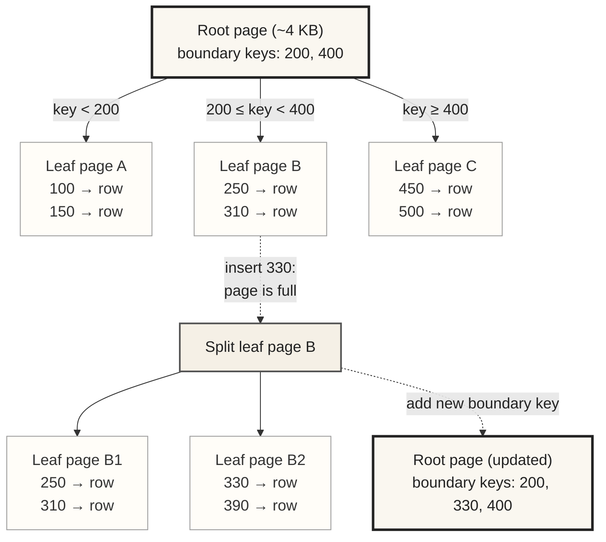
```mermaid
%%{init: {'themeVariables': {'fontSize': '18px'}}}%%
flowchart TB
    ROOT["Root page (~4 KB)<br/>boundary keys: 200, 400"]

    ROOT -->|"key &lt; 200"| L1["Leaf page A<br/>100 → row<br/>150 → row"]
    ROOT -->|"200 ≤ key &lt; 400"| L2["Leaf page B<br/>250 → row<br/>310 → row"]
    ROOT -->|"key ≥ 400"| L3["Leaf page C<br/>450 → row<br/>500 → row"]

    L2 -.->|"insert 330:<br/>page is full"| SPLIT["Split leaf page B"]
    SPLIT --> L2A["Leaf page B1<br/>250 → row<br/>310 → row"]
    SPLIT --> L2B["Leaf page B2<br/>330 → row<br/>390 → row"]
    SPLIT -.->|"add new boundary key"| ROOT2["Root page (updated)<br/>boundary keys: 200, 330, 400"]

    classDef root fill:#faf7f0,stroke:#222,stroke-width:3px,color:#222,font-size:18px;
    classDef leaf fill:#fffdf8,stroke:#999,stroke-width:1px,color:#333,font-size:18px;
    classDef proc fill:#f5f0e6,stroke:#555,stroke-width:2px,color:#222,font-size:18px;

    class ROOT,ROOT2 root;
    class L1,L2,L3,L2A,L2B leaf;
    class SPLIT proc;
```

### Advantages of LSM-trees

- **Higher write throughput** — a single logical write to a B-tree can turn into several page overwrites (write amplification: the leaf page itself, plus any pages touched by a split); an LSM-tree write is just an append to the memtable and log, so it does far less I/O per write.
- **Sequential over random I/O** — SSTable flushes and compaction always write large, compact files sequentially, instead of overwriting scattered pages in place. Sequential writes are much faster than random writes, especially on magnetic hard drives, and easier on SSD wear too.
- **Smaller files on disk** — LSM-trees aren't page-oriented, so they avoid the fragmentation B-trees leave behind (unused space in a page after a split, or a row that doesn't quite fit). Compaction periodically rewrites SSTables and reclaims that wasted space.
- **Better compression** — because compaction already groups and rewrites records together, LSM-trees compress more effectively than B-trees, shrinking on-disk size further — especially with leveled compaction.


### Storing values within the index

#### Primary key vs. secondary index

- **Primary key** — the column (or columns) that uniquely identifies each row in a table, e.g. `user_id`. A table has exactly one primary key, and its index is usually the main path to a row — in some designs (see *clustered index* below) it's the very place the row's data is stored.
- **Secondary index** — any other index built on a non-primary-key column, e.g. `email` or `city`, to make lookups and filters on that column fast. A table can have any number of secondary indexes. Because the same value can appear in many rows (many users can live in "London"), a secondary-index entry can't just *be* the row — it has to store something that leads back to it: either a heap-file location or the row's primary key.

That last point is exactly what the three approaches below differ on: *how* a secondary index gets from "I found the key" to "here's the actual row."

The value a key points to can live in one of three places, each a different trade-off between read speed and duplication:

- **Heap file (nonclustered index)** — the index stores only a *reference* (a file offset or row ID) to where the full row actually lives, in a separate heap file. Because every secondary index just points at the same heap location, the row itself is never duplicated. An in-place update is cheap if the new value still fits in its old slot; if it grows, the row has to move to a new heap location.
- **Clustered index** — the full row is stored directly inside the index's own leaf pages, right next to its key, removing the extra hop to a heap file. MySQL's InnoDB always makes the primary key a clustered index (secondary indexes then refer to the primary key rather than a heap location); SQL Server allows one clustered index per table.
- **Covering index (index with included columns)** — a middle ground: the index stores the key plus a handful of extra "included" columns, but not the whole row. A query that only needs those columns is answered straight from the index; anything else still needs the hop to the heap file.

#### Heap file (nonclustered index)

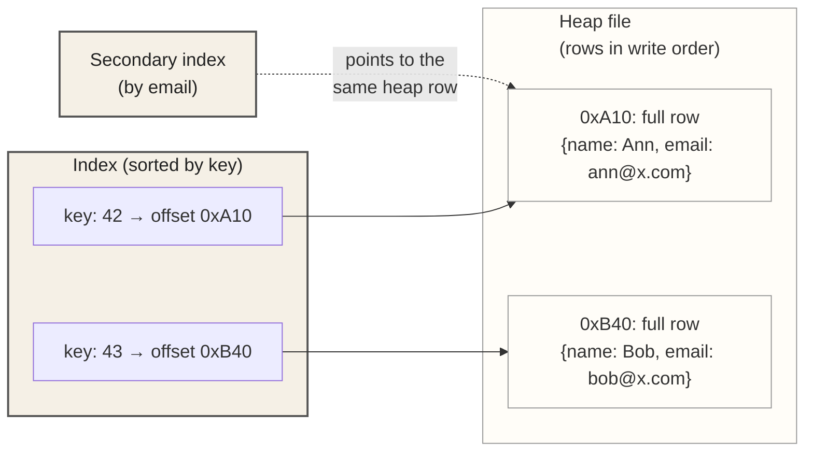
```mermaid
%%{init: {'themeVariables': {'fontSize': '18px'}}}%%
flowchart LR
    subgraph IDX["Index (sorted by key)"]
        direction TB
        I1["key: 42 → offset 0xA10"]
        I2["key: 43 → offset 0xB40"]
    end

    subgraph HEAP["Heap file<br/>(rows in write order)"]
        direction TB
        H1["0xA10: full row<br/>{name: Ann, email: ann@x.com}"]
        H2["0xB40: full row<br/>{name: Bob, email: bob@x.com}"]
    end

    SEC["Secondary index<br/>(by email)"] -.->|"points to the<br/>same heap row"| H1
    I1 --> H1
    I2 --> H2

    classDef idx fill:#f5f0e6,stroke:#555,stroke-width:2px,color:#222,font-size:18px;
    classDef heap fill:#fffdf8,stroke:#999,stroke-width:1px,color:#333,font-size:18px;

    class IDX,SEC idx;
    class HEAP,H1,H2 heap;
```

A lookup takes two hops: find the key in the index, then follow its pointer into the heap file to read the row. Because the row lives in exactly one place, any number of secondary indexes can reference it without copying it — the cost is that extra hop on every read.

#### Clustered index

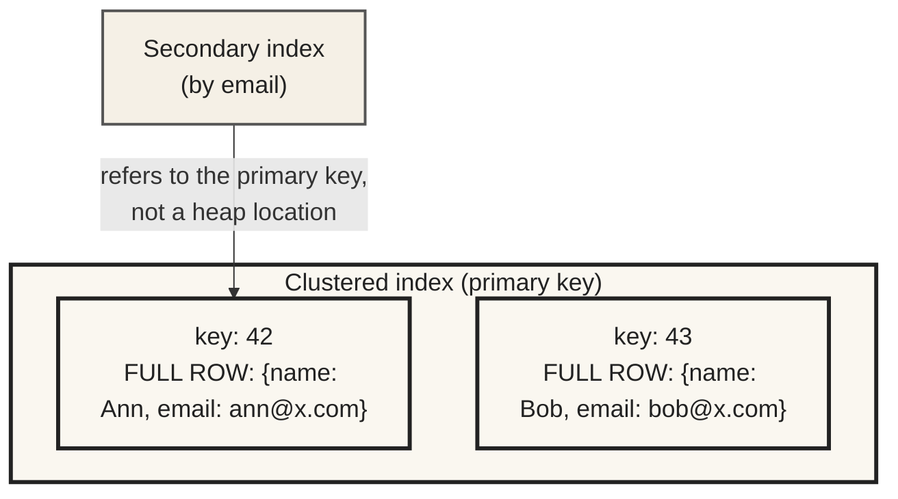
```mermaid
%%{init: {'themeVariables': {'fontSize': '18px'}}}%%
flowchart TB
    subgraph CIDX["Clustered index (primary key)"]
        direction TB
        C1["key: 42<br/>FULL ROW: {name: Ann, email: ann@x.com}"]
        C2["key: 43<br/>FULL ROW: {name: Bob, email: bob@x.com}"]
    end

    SEC["Secondary index<br/>(by email)"] -->|"refers to the primary key,<br/>not a heap location"| C1

    classDef idx fill:#faf7f0,stroke:#222,stroke-width:3px,color:#222,font-size:18px;
    classDef sec fill:#f5f0e6,stroke:#555,stroke-width:2px,color:#222,font-size:18px;

    class CIDX,C1,C2 idx;
    class SEC sec;
```

There's no separate heap file — the index's leaf page *is* the storage. A primary-key lookup reads the row in a single step. Secondary indexes still need one extra hop, but now it's through the clustered index rather than a heap file.

#### Covering index (index with included columns)

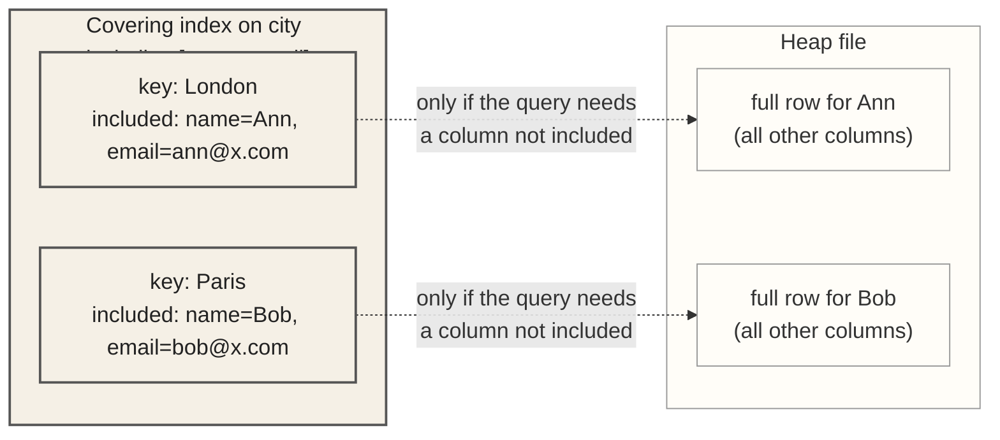
```mermaid
%%{init: {'themeVariables': {'fontSize': '18px'}}}%%
flowchart LR
    subgraph COV["Covering index on city<br/>including [name, email]"]
        direction TB
        V1["key: London<br/>included: name=Ann, email=ann@x.com"]
        V2["key: Paris<br/>included: name=Bob, email=bob@x.com"]
    end

    subgraph HEAP["Heap file"]
        direction TB
        H1["full row for Ann<br/>(all other columns)"]
        H2["full row for Bob<br/>(all other columns)"]
    end

    V1 -.->|"only if the query needs<br/>a column not included"| H1
    V2 -.->|"only if the query needs<br/>a column not included"| H2

    classDef idx fill:#f5f0e6,stroke:#555,stroke-width:2px,color:#222,font-size:18px;
    classDef heap fill:#fffdf8,stroke:#999,stroke-width:1px,color:#333,font-size:18px;

    class COV,V1,V2 idx;
    class HEAP,H1,H2 heap;
```

A query that only asks for `city`, `name`, and `email` is answered entirely from the index — no heap-file hop at all. Anything outside the included columns still pays that hop, so this is a deliberate trade: faster reads for the covered columns, in exchange for a bigger index that costs more to keep in sync on every write.


### Multi-column indexes

A single-column index can't answer a query that filters on several columns at once. There are two different ways to build an index that can:

- **Concatenated index** — combine several columns into one key by appending them in a fixed, declared order (e.g. `lastname, firstname`). This is exactly how a paper phone book works: everything is sorted by lastname first, and by firstname only *within* each lastname. It's fast for the leading column(s), or an exact combination, but nearly useless for querying the trailing column on its own.
- **Multi-dimensional index** — query several columns *as equals*, with no column privileged over another. This matters for geospatial data: a bounding-box query needs both latitude *and* longitude narrowed down together, which a (latitude, longitude) concatenated index can't do — it can only narrow down latitude first, then scan linearly within that. PostGIS solves this with an **R-tree**, built on PostgreSQL's **GiST** (Generalized Search Tree) indexing framework.

#### Concatenated index

```mermaid
%%{init: {'themeVariables': {'fontSize': '18px'}}}%%
flowchart TB
    subgraph IDX["Concatenated index, key = (lastname, firstname)"]
        direction TB
        K1["Smith, Anna → 555-1111"]
        K2["Smith, Bob → 555-2222"]
        K3["Smith, Carla → 555-3333"]
        K4["Turner, Amy → 555-4444"]
    end

    Q1["Query: lastname = 'Smith'"] -->|"contiguous range,<br/>fast scan"| K1
    Q1 --> K2
    Q1 --> K3

    Q2["Query: firstname = 'Amy'<br/>(any lastname)"] -.->|"not contiguous —<br/>must scan the whole index"| K1
    Q2 -.-> K2
    Q2 -.-> K3
    Q2 -.-> K4

    classDef idx fill:#f5f0e6,stroke:#555,stroke-width:2px,color:#222,font-size:18px;
    classDef good fill:#faf7f0,stroke:#222,stroke-width:3px,color:#222,font-size:18px;
    classDef bad fill:#fdf0e0,stroke:#a35b00,stroke-width:2px,color:#222,font-size:18px;

    class IDX,K1,K2,K3,K4 idx;
    class Q1 good;
    class Q2 bad;
```

Sorting by `(lastname, firstname)` puts every "Smith" row next to every other "Smith" row, so a lastname-only or full-pair query is a fast contiguous scan. But firstname alone isn't sorted across lastnames at all, so that query has to check every entry — exactly like flipping through a phone book looking for everyone named "Amy."

#### Multi-dimensional index (R-tree)

```mermaid
%%{init: {'themeVariables': {'fontSize': '18px'}}}%%
flowchart TB
    ROOT["R-tree root<br/>bounding box: all restaurants"]
    ROOT --> R1["Box A<br/>(central London)"]
    ROOT --> R2["Box B<br/>(outer London)"]

    R1 --> P1["Restaurant @ 51.503, -0.119"]
    R1 --> P2["Restaurant @ 51.507, -0.108"]
    R2 --> P3["Restaurant @ 51.480, -0.201"]

    Q["Query box:<br/>lat 51.4946–51.5079,<br/>lon -0.1162…-0.1004"] -->|"overlaps only Box A"| R1

    classDef box fill:#f5f0e6,stroke:#555,stroke-width:2px,color:#222,font-size:18px;
    classDef point fill:#fffdf8,stroke:#999,stroke-width:1px,color:#333,font-size:18px;
    classDef query fill:#fdf0e0,stroke:#a35b00,stroke-width:2px,color:#222,font-size:18px;

    class ROOT,R1,R2 box;
    class P1,P2,P3 point;
    class Q query;
```

Instead of sorting by one column and then the other, an R-tree groups nearby points into bounding boxes recursively. A range query on both latitude and longitude just walks down the boxes that overlap the query box — Box B is skipped entirely without ever comparing an individual row — something a concatenated `(latitude, longitude)` B-tree index can't do.

### Full-text search and fuzzy indexes

All the indexes above need an **exact key** (or a range of keys). They can't find *similar* keys, such as a misspelled word — fuzzy querying needs different techniques.

- **Synonym expansion** — a full-text search engine expands a search for one word to include its synonyms.
- **Edit distance** — Lucene finds words within a given edit distance. Distance 1 means one letter was added, removed, or replaced.

```mermaid
%%{init: {'themeVariables': {'fontSize': '18px'}}}%%
flowchart LR
    Q["User query:<br/>'recieve' (typo)"]

    Q -->|"exact-key index"| X["No match<br/>key 'recieve' does not exist"]

    Q -->|"fuzzy search<br/>(edit distance ≤ 2)"| F["Candidate terms in index"]
    F --> T1["'receive'<br/>distance 2 (swap i/e) ✔"]
    F --> T2["'relieve'<br/>distance 2 ✔"]
    F --> T3["'recipe'<br/>distance 3 ✘"]

    Q -->|"synonym expansion"| S["'receive' → 'get', 'obtain', 'accept'"]

    classDef bad fill:#fbe9e7,stroke:#b23b2e,stroke-width:2px,color:#222,font-size:18px;
    classDef good fill:#e8f3e8,stroke:#2e7d32,stroke-width:2px,color:#222,font-size:18px;
    classDef neutral fill:#f5f0e6,stroke:#555,stroke-width:2px,color:#222,font-size:18px;

    class X,T3 bad;
    class T1,T2,S good;
    class Q,F neutral;
```

A normal index lookup for `recieve` returns nothing, because that exact key was never stored. A fuzzy search instead compares the query against indexed terms and keeps those within the allowed edit distance, so `receive` is found. Synonym expansion works the other way round: it widens the query to related words instead of tolerating typos.


### Keeping everything in memory

As RAM gets cheaper, the cost-per-gigabyte argument for disks weakens. Many datasets are simply not that big, so keeping them entirely in memory is feasible.

- **Cache-only stores** — Memcached is meant for caching, where losing data on restart is acceptable.
- **Durable in-memory stores** — durability comes from one of these:
  - battery-powered RAM (special hardware)
  - a log of changes written to disk
  - periodic snapshots written to disk
  - replicating the in-memory state to other machines
- **Restart** — the database must reload its state from disk or over the network from a replica (unless special hardware is used).
- **Relational in-memory databases** — VoltDB, MemSQL and Oracle TimesTen. Vendors claim big speedups from removing the overhead of managing on-disk data structures.
- **Weak durability** — Redis and Couchbase write to disk asynchronously.

```mermaid
%%{init: {'themeVariables': {'fontSize': '18px'}}}%%
flowchart LR
    W["Write / update"] --> MEM["In-memory database<br/>(all data in RAM, fast reads)"]
    R["Read"] --> MEM

    MEM -.->|"1. append change log"| LOG[("Disk: log")]
    MEM -.->|"2. periodic snapshot"| SNAP[("Disk: snapshot")]
    MEM -.->|"3. replicate"| REP["Replica<br/>(another machine's RAM)"]

    CRASH["Restart / crash"] -->|"reload"| LOG
    CRASH -->|"reload"| SNAP
    CRASH -->|"or copy over network"| REP

    CACHE["Memcached<br/>(cache only, no persistence)"]

    classDef mem fill:#e8f3e8,stroke:#2e7d32,stroke-width:2px,color:#222,font-size:18px;
    classDef disk fill:#f5f0e6,stroke:#555,stroke-width:2px,color:#222,font-size:18px;
    classDef warn fill:#fbe9e7,stroke:#b23b2e,stroke-width:2px,color:#222,font-size:18px;

    class MEM,REP mem;
    class LOG,SNAP disk;
    class CRASH,CACHE warn;
```

Reads and writes are served from RAM, so the speedup doesn't come from avoiding disk reads. The book notes that even disk-based stores serve hot data from the OS cache. It comes from skipping the overhead of encoding in-memory structures into a disk-friendly format. The disk only holds a log or snapshot so the state can be rebuilt after a restart, and a replica can do the same job. Memcached skips all of this and simply loses its data on restart.


#### Beyond the performance argument

- **Richer data models** — in-memory stores can offer data structures that are hard to implement on disk. Redis gives a database-like interface to priority queues and sets, and keeping all data in memory keeps its implementation comparatively simple.
- **Anti-caching** — lets a dataset exceed available memory. When memory runs out, the least recently used data is evicted to disk and loaded back when it is accessed again. The OS does the same with virtual memory and swap files, but the database can manage memory more efficiently because it knows its own access patterns, and it can evict whole records instead of whole pages.
- **Non-volatile memory (NVM)** — if it becomes widely adopted, storage engines may need to change again. It is still a new research area, but worth watching.

```mermaid
%%{init: {'themeVariables': {'fontSize': '18px'}}}%%
flowchart LR
    APP["Application"] -->|"read / write"| RAM["RAM<br/>(hot data)"]

    RAM -->|"memory full:<br/>evict least recently used"| DISK[("Disk<br/>(cold data)")]
    APP -->|"access cold record"| RAM
    DISK -->|"load back on access"| RAM

    RAM --- DS["Redis data structures:<br/>priority queue, set, ..."]

    NVM["NVM<br/>(persistent, near-RAM speed)"] -.->|"may blur the RAM / disk split"| RAM

    classDef mem fill:#e8f3e8,stroke:#2e7d32,stroke-width:2px,color:#222,font-size:18px;
    classDef disk fill:#f5f0e6,stroke:#555,stroke-width:2px,color:#222,font-size:18px;
    classDef future fill:#fdf0e0,stroke:#a35b00,stroke-width:2px,color:#222,font-size:18px;

    class RAM,DS mem;
    class DISK,APP disk;
    class NVM future;
```

Anti-caching works like OS swap, with the database deciding what to evict. Hot records stay in RAM, cold ones move to disk, and a cold record is loaded back when a query touches it. Redis shows the other advantage of in-memory storage: plain in-memory data structures can be exposed directly instead of being encoded for disk.

### Transaction Processing or Analytics?

ACID (atomicity, consistency, isolation, durability) is the set of guarantees that traditional transactional (OLTP) databases give for a transaction — a group of reads and writes treated as one logical unit.

Running example: transfer $100 from account A to account B (`A -= 100`, `B += 100`).

#### Atomicity

A transaction is all-or-nothing. If any step fails, everything done so far is rolled back, so there is no half-finished state.

```mermaid
%%{init: {'themeVariables': {'fontSize': '18px'}}}%%
flowchart LR
    S["Start transfer"] --> D["A -= 100 ✔"]
    D --> C["B += 100 ✘ crash"]
    C -->|"rollback"| U["A restored to original<br/>nothing applied"]

    classDef ok fill:#e8f3e8,stroke:#2e7d32,stroke-width:2px,color:#222,font-size:18px;
    classDef bad fill:#fbe9e7,stroke:#b23b2e,stroke-width:2px,color:#222,font-size:18px;
    classDef neutral fill:#f5f0e6,stroke:#555,stroke-width:2px,color:#222,font-size:18px;

    class S neutral;
    class D,U ok;
    class C bad;
```

The $100 is never lost: either both updates happen or neither does.

#### Consistency

The transaction moves the database from one valid state to another, so application-defined invariants still hold (e.g. total money across accounts is unchanged, balance never negative). This one relies on the application as much as on the database: the database enforces constraints it knows about, but the application defines what "valid" means.

```mermaid
%%{init: {'themeVariables': {'fontSize': '18px'}}}%%
flowchart LR
    V1["Valid state<br/>A=500, B=300<br/>invariant: A + B = 800"]

    V1 -->|"Tx 1: A -= 100, B += 100"| CHK1{"Invariant<br/>A + B = 800?"}
    CHK1 -->|"yes (400 + 400)"| V2["Commit<br/>new valid state<br/>A=400, B=400"]

    V1 -->|"Tx 2 (buggy): B += 100 only"| CHK2{"Invariant<br/>A + B = 800?"}
    CHK2 -->|"no (500 + 400 = 900)"| X["Reject / abort<br/>state stays A=500, B=300"]

    classDef ok fill:#e8f3e8,stroke:#2e7d32,stroke-width:2px,color:#222,font-size:18px;
    classDef bad fill:#fbe9e7,stroke:#b23b2e,stroke-width:2px,color:#222,font-size:18px;
    classDef neutral fill:#f5f0e6,stroke:#555,stroke-width:2px,color:#222,font-size:18px;

    class V1,CHK1,CHK2 neutral;
    class V2 ok;
    class X bad;
```

Both transactions start from the same valid state. Tx 1 keeps the invariant (total stays 800) and commits. Tx 2 creates money from nowhere (total 900), so it is rejected. The database can only reject it if the invariant is declared as a constraint; otherwise the application must avoid writing such a transaction.

#### Isolation

Concurrent transactions don't see each other's half-done work. Each behaves as if it ran alone, as if the transactions ran one after another (serially).

```mermaid
%%{init: {'themeVariables': {'fontSize': '18px'}}}%%
sequenceDiagram
    participant T1 as Tx 1: transfer A to B
    participant DB as Database
    participant T2 as Tx 2: read total

    T1->>DB: A -= 100
    T2->>DB: read A and B
    Note over DB: Tx 2 must not see A already reduced<br/>while B is not yet increased
    T1->>DB: B += 100
    T1->>DB: commit
    DB-->>T2: consistent total (before or after, never in between)
```

Without isolation, Tx 2 could see A reduced but B not yet increased and report $100 missing.

#### Durability

Once a transaction is committed, its data survives crashes and power loss, typically because it was written to non-volatile storage (and a write-ahead log) before the commit was acknowledged.

```mermaid
%%{init: {'themeVariables': {'fontSize': '18px'}}}%%
flowchart LR
    TX["Transaction"] --> WAL[("Write to disk<br/>(log / storage)")]
    WAL --> ACK["Commit acknowledged<br/>to client"]
    ACK --> CR["Power loss / crash"]
    CR --> REC["Restart: committed data<br/>recovered from disk"]

    classDef ok fill:#e8f3e8,stroke:#2e7d32,stroke-width:2px,color:#222,font-size:18px;
    classDef bad fill:#fbe9e7,stroke:#b23b2e,stroke-width:2px,color:#222,font-size:18px;
    classDef disk fill:#f5f0e6,stroke:#555,stroke-width:2px,color:#222,font-size:18px;

    class TX,ACK,REC ok;
    class WAL disk;
    class CR bad;
```

The client is told "committed" only after the data is safely stored, so an acknowledged transfer is never lost.

#### Online transaction processing (OLTP)

OLTP is the access pattern of interactive applications: many users each read or write a small number of records, usually looked up by key, with low latency. Each write is a small transaction (an order, a payment, a profile update), which is why OLTP databases provide the ACID guarantees above. The term comes from early business processing, where a "transaction" was a commercial deal. Today it covers any low-latency read or write of a few records.

Typical traits:

- **Read pattern** — a small number of records per query, fetched by key.
- **Write pattern** — random-access, low-latency writes from user input.
- **Used by** — end users and customers through a web or mobile application.
- **Data** — the latest state of the data, at the current point in time.
- **Bottleneck** — disk seek time, which is why indexes (B-trees, LSM-trees) matter.

```mermaid
%%{init: {'themeVariables': {'fontSize': '18px'}}}%%
flowchart LR
    U1["User 1<br/>place order"] --> APP["Web / mobile<br/>application"]
    U2["User 2<br/>update profile"] --> APP
    U3["User 3<br/>pay invoice"] --> APP

    APP -->|"many small queries<br/>by key, low latency"| DB[("OLTP database<br/>(ACID transactions,<br/>indexed lookups)")]

    DB --> R1["read order #42"]
    DB --> R2["update user #7"]
    DB --> R3["insert payment #913"]

    classDef user fill:#fdf0e0,stroke:#a35b00,stroke-width:2px,color:#222,font-size:18px;
    classDef app fill:#f5f0e6,stroke:#555,stroke-width:2px,color:#222,font-size:18px;
    classDef db fill:#e8f3e8,stroke:#2e7d32,stroke-width:2px,color:#222,font-size:18px;

    class U1,U2,U3 user;
    class APP app;
    class DB,R1,R2,R3 db;
```

Every user action turns into a few tiny reads or writes of individual records, and the database must answer each quickly while many users do the same at once. This contrasts with analytics, which scans huge numbers of records to compute aggregates.

#### Analytics (OLAP)

An analytic query usually scans a huge number of records, reads only a few columns per record, and computes aggregate statistics (count, sum, average) instead of returning raw rows to the user. For a table of sales transactions, typical analytic questions are:

- What was the total revenue of each of our stores in January?
- How many more bananas than usual did we sell during our latest promotion?
- Which brand of baby food is most often purchased together with brand X diapers?

```mermaid
%%{init: {'themeVariables': {'fontSize': '18px'}}}%%
flowchart LR
    AN["Analyst / BI tool<br/>'revenue per store in January?'"] -->|"one big query"| DB[("Analytic database<br/>sales table: billions of rows")]

    DB -->|"scan all January rows,<br/>read only store_id + amount"| AGG["Aggregate<br/>SUM(amount) GROUP BY store_id"]
    AGG --> RES["Small result<br/>Store 1: $1.2M<br/>Store 2: $0.9M<br/>Store 3: $1.5M"]

    classDef user fill:#fdf0e0,stroke:#a35b00,stroke-width:2px,color:#222,font-size:18px;
    classDef db fill:#e8f3e8,stroke:#2e7d32,stroke-width:2px,color:#222,font-size:18px;
    classDef neutral fill:#f5f0e6,stroke:#555,stroke-width:2px,color:#222,font-size:18px;

    class AN user;
    class DB db;
    class AGG,RES neutral;
```

Compared with OLTP, the access pattern flips. OLTP reads a few whole records by key. Analytics reads a few columns from millions of records and boils them down to a handful of numbers, so the bottleneck is scan throughput over large volumes of data, not seek time.

### Data Warehousing

A data warehouse is a separate database that analysts can query as heavily as they like without affecting OLTP operations. It holds a read-only copy of the data from all the OLTP systems in the company. Data gets into the warehouse through Extract–Transform–Load (ETL):

- **Extract** — pull data from the OLTP databases, either as a periodic dump or as a continuous stream of updates.
- **Transform** — clean it up and convert it into an analysis-friendly schema.
- **Load** — write it into the warehouse.

The main reason for a separate database is that OLTP systems must stay fast and available for users. Expensive analytic scans on them would slow down customers, and the warehouse can use storage layouts and indexes tuned for analytics instead.

```mermaid
%%{init: {'themeVariables': {'fontSize': '18px'}}}%%
flowchart LR
    subgraph OLTP["OLTP systems (serve users, must stay fast)"]
        S1[("Orders DB")]
        S2[("Users DB")]
        S3[("Payments DB")]
    end

    S1 --> ETL
    S2 --> ETL
    S3 --> ETL

    ETL["ETL<br/>Extract → Transform → Load"] --> DW[("Data warehouse<br/>read-only copy,<br/>analysis-friendly schema")]

    DW --> A1["Analysts"]
    DW --> A2["BI dashboards"]
    DW --> A3["Reports"]

    classDef oltp fill:#f5f0e6,stroke:#555,stroke-width:2px,color:#222,font-size:18px;
    classDef etl fill:#fdf0e0,stroke:#a35b00,stroke-width:2px,color:#222,font-size:18px;
    classDef dw fill:#e8f3e8,stroke:#2e7d32,stroke-width:2px,color:#222,font-size:18px;

    class S1,S2,S3 oltp;
    class ETL etl;
    class DW,A1,A2,A3 dw;
```

Analysts query the warehouse, never the OLTP databases, so heavy analytic queries can't slow down the application. The price is that the warehouse data lags behind the live systems by however often ETL runs.


### The divergence between OLTP databases and data warehouses

A data warehouse and a relational OLTP database look alike on the surface but are built differently inside.

- **Same interface** — the warehouse data model is most commonly relational, because SQL fits analytic queries well. Both kinds of system expose SQL.
- **Different internals** — the two are optimized for opposite access patterns, so their storage engines and query execution differ.
- **Examples** — Amazon Redshift (a hosted version of ParAccel) is a commercial warehouse. Open-source SQL-on-Hadoop projects, such as Apache Hive, Spark SQL, Cloudera Impala, Facebook Presto and Apache Tajo, are young but aim to compete with commercial warehouses.

```mermaid
%%{init: {'themeVariables': {'fontSize': '18px'}}}%%
flowchart TB
    SQL["SQL query interface<br/>(looks the same)"]

    SQL --> OLTP["Relational OLTP database<br/>small key-based reads/writes,<br/>ACID transactions"]
    SQL --> DW["Data warehouse<br/>large scans + aggregates<br/>over few columns"]

    DW --> E1["Amazon Redshift<br/>(hosted ParAccel)"]
    DW --> E2["SQL-on-Hadoop:<br/>Hive, Spark SQL, Impala,<br/>Presto, Tajo"]

    classDef shared fill:#fdf0e0,stroke:#a35b00,stroke-width:2px,color:#222,font-size:18px;
    classDef oltp fill:#f5f0e6,stroke:#555,stroke-width:2px,color:#222,font-size:18px;
    classDef dw fill:#e8f3e8,stroke:#2e7d32,stroke-width:2px,color:#222,font-size:18px;

    class SQL shared;
    class OLTP oltp;
    class DW,E1,E2 dw;
```

The shared SQL interface hides the difference, but the engines underneath are tuned for opposite workloads.


### Stars and Snowflakes: Schemas for Analytics

Analytic data is usually modeled around one huge **fact table** that points to smaller **dimension tables**.

- **Fact table** — each row is an event at a particular time (here, a customer buying a product). For website traffic, a row would be a page view or a click.
- **Individual events** — facts are usually stored as individual events, which gives maximum flexibility for later analysis.
- **Size** — this makes the fact table extremely large. Enterprises like Apple, Walmart or eBay may hold tens of petabytes of transaction history.
- **Dimension tables** — other columns in the fact table are foreign keys to dimension tables. They describe the who, what, where, when, how and why of the event.

```mermaid
%%{init: {'themeVariables': {'fontSize': '18px'}}}%%
flowchart LR
    subgraph FACT["fact_sales<br/>1 row = 1 purchase"]
        direction TB
        F1["#1 · qty 2 · $6.00"]
        F2["#2 · qty 1 · $3.50"]
        F3["#3 · qty 5 · $12.00"]
    end

    subgraph DIM["Dimension tables"]
        direction TB
        D1["dim_customer<br/>WHO: Alice"]
        D2["dim_product<br/>WHAT: Bananas"]
        D3["dim_store<br/>WHERE: London"]
        D4["dim_date<br/>WHEN: 2026-01-05"]
    end

    F1 -->|"customer_key"| D1
    F1 -->|"product_key"| D2
    F2 -->|"store_key"| D3
    F3 -->|"date_key"| D4

    classDef fact fill:#e8f3e8,stroke:#2e7d32,stroke-width:2px,color:#222,font-size:18px;
    classDef dim fill:#f5f0e6,stroke:#555,stroke-width:2px,color:#222,font-size:18px;
    class F1,F2,F3 fact;
    class D1,D2,D3,D4 dim;
    style FACT fill:#fff,stroke:#2e7d32,stroke-width:2px,color:#222
    style DIM fill:#fff,stroke:#555,stroke-width:2px,color:#222
```

Each fact row records only what happened (quantity, price) plus keys. The details, such as who bought it, what it was and where, live in the dimension tables, so they are stored once and not repeated in every row of the huge fact table.

### Star Schema

The name comes from the shape of the diagram: the fact table sits in the middle, surrounded by its dimension tables, and the connections to them look like the rays of a star.

A variation of this template is known as the snowflake schema, where dimensions are
further broken down into subdimensions. For example, there could be separate tables
for brands and product categories, and each row in the dim_product table could ref‐
erence the brand and category as foreign keys

- **Fact table** — one row per event (here, a purchase). Besides measures like price and quantity, it holds foreign keys to the dimension tables.
- **Dimension tables** — describe the who, what, where, when, how and why of each event.

```mermaid
block-beta
    columns 5
    space DATE["<b>dim_date</b><br/>WHEN<br/>day · month · year"] space PRODUCT["<b>dim_product</b><br/>WHAT<br/>name · brand · category"] space
    space:5
    space space FACT[("<b>fact_sales</b><br/>one row per purchase<br/>date_key · product_key<br/>store_key · customer_key<br/>quantity · net_price")] space space
    space:5
    space STORE["<b>dim_store</b><br/>WHERE<br/>city · country"] space CUSTOMER["<b>dim_customer</b><br/>WHO<br/>name · segment"] space

    DATE --- FACT
    PRODUCT --- FACT
    STORE --- FACT
    CUSTOMER --- FACT

    classDef fact fill:#e8f3e8,stroke:#2e7d32,stroke-width:3px,color:#222
    classDef dim fill:#f5f0e6,stroke:#555,stroke-width:2px,color:#222
    class FACT fact
    class DATE,PRODUCT,STORE,CUSTOMER dim
```

An analytic query joins the big fact table to the small dimension tables it needs, for example sales by store and month.

### Column-Oriented Storage

How can we execute this query efficiently?

```sql
SELECT
    dim_date.weekday,
    dim_product.category,
    SUM(fact_sales.quantity) AS quantity_sold
FROM fact_sales
JOIN dim_date
    ON fact_sales.date_key = dim_date.date_key
JOIN dim_product
    ON fact_sales.product_sk = dim_product.product_sk
WHERE
    dim_date.year = 2013
    AND dim_product.category IN ('Fresh fruit', 'Candy')
GROUP BY
    dim_date.weekday,
    dim_product.category;
```

In most OLTP databases, storage is **row-oriented**: all the values from one row are stored next to each other. Document databases are similar: a whole document is typically stored as one contiguous sequence of bytes. A CSV file is the same idea.

The query above only needs `date_key`, `product_sk` and `quantity` from `fact_sales`, but a row-oriented engine loads every whole row, including columns it never uses. Real fact tables often have hundreds of columns.

```mermaid
%%{init: {'themeVariables': {'fontSize': '18px'}}}%%
flowchart LR
    D["Row-oriented file on disk"] --> R1["row 1<br/>140102 · 69 · 1 · 13.99"] --> R2["row 2<br/>140102 · 69 · 3 · 14.50"] --> R3["row 3<br/>140103 · 74 · 2 · 6.00"]
    R3 --> Q["Query needs date_key, product_sk, quantity<br/>but still loads whole rows, including net_price"]

    classDef row fill:#f5f0e6,stroke:#555,stroke-width:2px,color:#222,font-size:18px;
    classDef note fill:#fbe9e7,stroke:#b23b2e,stroke-width:2px,color:#222,font-size:18px;
    class D,R1,R2,R3 row;
    class Q note;
```

#### Column-oriented storage

The idea is simple: don't store all the values from one row together, store all the values from each column together instead. If each column is in a separate file, a query reads and parses only the columns it uses, which saves a lot of work.

```mermaid
%%{init: {'themeVariables': {'fontSize': '18px'}}}%%
flowchart TB
    C1["date_key file<br/>1: 140102<br/>2: 140102<br/>3: 140103"]
    C2["product_sk file<br/>1: 69<br/>2: 69<br/>3: 74"]
    C3["quantity file<br/>1: 1<br/>2: 3<br/>3: 2"]
    C4["net_price file<br/>1: 13.99<br/>2: 14.50<br/>3: 6.00<br/>(not read)"]

    C1 --> Q
    C2 --> Q
    C3 --> Q
    Q["Query reads only the 3 columns it uses"]

    classDef col fill:#e8f3e8,stroke:#2e7d32,stroke-width:2px,color:#222,font-size:18px;
    classDef skip fill:#f5f0e6,stroke:#999,stroke-width:2px,stroke-dasharray:5 5,color:#666,font-size:18px;
    classDef note fill:#fdf0e0,stroke:#a35b00,stroke-width:2px,color:#222,font-size:18px;
    class C1,C2,C3 col;
    class C4 skip;
    class Q note;
```

The layout relies on every column file holding the rows in the same order. To reassemble a whole row, take the 23rd entry from each column file and put them together to form the 23rd row of the table. In the example above, row 3 is `(140103, 74, 2, 6.00)`: the 3rd entry of each of the four files.


### Memory bandwidth and vectorized processing

Main idea: disk bandwidth isn't the only bottleneck in analytic scans. Column storage also helps the CPU itself.

- **Other bottlenecks** — bandwidth from main memory into the CPU cache, branch mispredictions, pipeline bubbles, and unused SIMD (single-instruction-multi-data) capability.
- **Tight loops** — the engine takes a compressed column chunk that fits in the L1 cache and iterates over it in a tight loop with no function calls. This runs much faster than per-record code full of function calls and conditions.
- **Compression helps twice** — more rows of a column fit in the same L1 cache. Operators such as bitwise AND and OR work directly on the compressed chunks.
- **Vectorized processing** — the name for this technique.

```mermaid
%%{init: {'themeVariables': {'fontSize': '18px'}}}%%
flowchart LR
    DISK[("Disk<br/>compressed column")] -->|"1. disk to memory<br/>(less data to load)"| RAM["Main memory"]
    RAM -->|"2. memory to CPU cache<br/>(chunk fits in L1)"| L1["CPU L1 cache<br/>compressed chunk,<br/>more rows fit"]
    L1 -->|"3. tight loop, no function calls<br/>SIMD: many values per instruction"| CPU["CPU<br/>AND / OR directly on<br/>compressed data"]

    classDef disk fill:#f5f0e6,stroke:#555,stroke-width:2px,color:#222,font-size:18px;
    classDef fast fill:#e8f3e8,stroke:#2e7d32,stroke-width:2px,color:#222,font-size:18px;
    class DISK,RAM disk;
    class L1,CPU fast;
```

### Sort Order in Column Storage

Even though data is stored by column, it is sorted **an entire row at a time**. You can't sort each column independently, because the column files must stay aligned: the *n*th entry of every file belongs to the same row.

- **Sort keys** — the administrator picks the columns to sort by, based on knowledge of common queries. The first key sorts the table, the second key breaks ties within equal first-key values, and so on.
- **Example** — if queries often target a date range, such as the last month, make `date_key` the first sort key. Then a range query reads one contiguous slice of each column instead of scanning the whole table.

```mermaid
%%{init: {'themeVariables': {'fontSize': '18px'}}}%%
flowchart LR
    C1["date_key<br/>(1st sort key)<br/>1: 140101<br/>2: 140101<br/>3: 140102<br/>4: 140102<br/>5: 140103"]
    C2["product_sk<br/>(2nd sort key)<br/>1: 31<br/>2: 69<br/>3: 31<br/>4: 69<br/>5: 74"]
    C3["quantity<br/>(follows row order)<br/>1: 2<br/>2: 1<br/>3: 5<br/>4: 3<br/>5: 2"]

    C1 --- C2 --- C3
    C3 --> Q["Query: date_key 140102 to 140103<br/>reads one contiguous slice,<br/>entries 3 to 5, in each column"]

    classDef col fill:#e8f3e8,stroke:#2e7d32,stroke-width:2px,color:#222,font-size:18px;
    classDef note fill:#fdf0e0,stroke:#a35b00,stroke-width:2px,color:#222,font-size:18px;
    class C1,C2,C3 col;
    class Q note;
```

In the example, rows are ordered by `date_key`, then `product_sk`. Rows for 140102 to 140103 sit together at positions 3 to 5, and the same positions in the `product_sk` and `quantity` files hold the rest of those rows.

#### Sorting helps compression

If the primary sort column has few distinct values, sorting it produces long runs of the same value. Runs compress very well, for example with run-length encoding.

```mermaid
%%{init: {'themeVariables': {'fontSize': '18px'}}}%%
flowchart LR
    U["Unsorted<br/>A, B, A, C, B, A, C, B, A"] -->|"sort rows by this column"| S["Sorted<br/>A, A, A, A, B, B, B, C, C"]
    S -->|"run-length encode"| R["A×4, B×3, C×2<br/>(9 values stored as 3 runs)"]

    classDef before fill:#f5f0e6,stroke:#555,stroke-width:2px,color:#222,font-size:18px;
    classDef after fill:#e8f3e8,stroke:#2e7d32,stroke-width:2px,color:#222,font-size:18px;
    class U before;
    class S,R after;
```

Run-length encoding replaces a run of identical adjacent values with the value and a count, so `A, A, A, A` becomes `4×A`. A sort key is just the column you sort by, not a unique key, so many rows can share the same value. Sorting puts the rows with the same value in that column next to each other. It only pays off under these conditions:

- **Adjacent values only** — without sorting, `A, B, A, A, B` has no run longer than 2, so there is little to compress.
- **Few distinct values** — if the column has millions of distinct values, sorting still gives runs of length 1 and saves nothing.
- **First sort column only** — later sort keys are sorted only within equal values of the earlier ones, so their runs are shorter.


### Writing to Column-Oriented Storage
